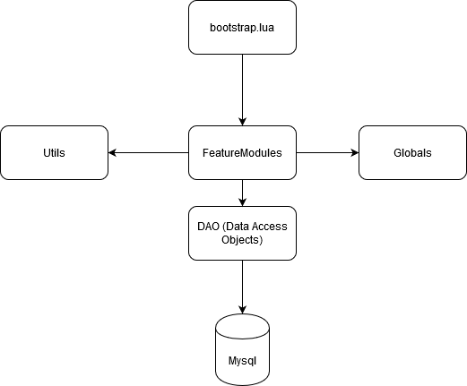

# gothic-multiplayer-adventures-server - Khorinis stories expansion base
Server code for the Gothic Multiplayer Adventures Server.
Contains the additional base code that is used for the 'Khorinis stories' expansion features.

# GMA
This project contains the server code for the 'Gothic Multiplayer Adventure Server'. The goal is to show how such a server can be set up and how certain features like login, registration, npc's can be implemented.
To run the code you need the 'Gothic Multiplayer Server' and the 'Gothic Multiplayer Client'. Both the server and client wont be provided here, but can be found in the World of Gothic community.

I tried to remove all code that initially required the specific GMA.mod that contained custom items like weapons, armors etc. However it's still possible that you will find code snippets with unknown item instances. These can be safely removed if you find them. The code should run without them. 

Unfortunately i have not written any test cases for the code. Most features were superfically tested manually and probably still contain a lot of bugs. If you run into issues you can't fix yourself you're invited to send me an email at 'lucy.johnson.99.08.18@gmail.com'. Either in in english, german, or spanish.

Youre allowed to use the code in this repository as you please. If you set up some badass server i would be happy to here from it.

## Directories:
The project contains 5 main directories. 

### filterscripts: 
Contains a debug script that should me removed, once you run your server publicly.

### gamemodes:
Contains the 'bootstrap.lua'. This is the entry point of the server. All server code modules will be loaded here.

### scripts: 
Contains all scrips that are used for the monster AI. The code was mainly written by Mainclain (Greatest Senpai in the history of GMP). 
Most changes by GMA were additional NPC's

### serverscripts: 
Contains the main scripts for the GMA Server. For more information read the Macro architecture section.

### sqlscripts: 
Contains all SQL-Scripts that you need to reconstruct the database model.

## Macro architecture:

This is the macro architecture of the server.

The application starts with the 'bootstrap.lua'. From there on all calls will be redirected to 'feature modules'. Feature modules are subdirectories which contain the scripts for specific features. 

**Important:** It's recommended that 'feature modules' dont make calls between each other. That makes it possible to slot them out easily. This is a useful property since you have to remove/add new features regulary as an server owner for your players.

However feature modules are allowed to call any other code that are outside of other 'feature modules' like 'utils', 'globals', 'DAO's (data access objects)'. Feature modules are also allowed to call functions scripts inside their own module/subdirectory.

DAO's (data access objects) play an important role since they represent the layer that communicates with the database. All queries will be executed here. I havent thought of a way yet to perfectly separate query code from the feature code. So you might find strange constellations where you are calling mysql functions in a feature module. Sorry for that.

## Possible workflow:

If you want to implement a new feature, it's recommended that you create a new subdirectory in the 'feature_modules' directory. The code uses Lua's module syntax to encapsulate the functionality. A feature module directory normally has a single bootstrap script that redirects all calls to the scripts in the subdirectory and exposes these functionalies in a single table. So for example if you have a subdirectory called 'respawn_module' there should be a file called 'respawn_module.lua' that redirects all calls to the files in the subdirectory.

## License
[MIT](https://choosealicense.com/licenses/mit/)

